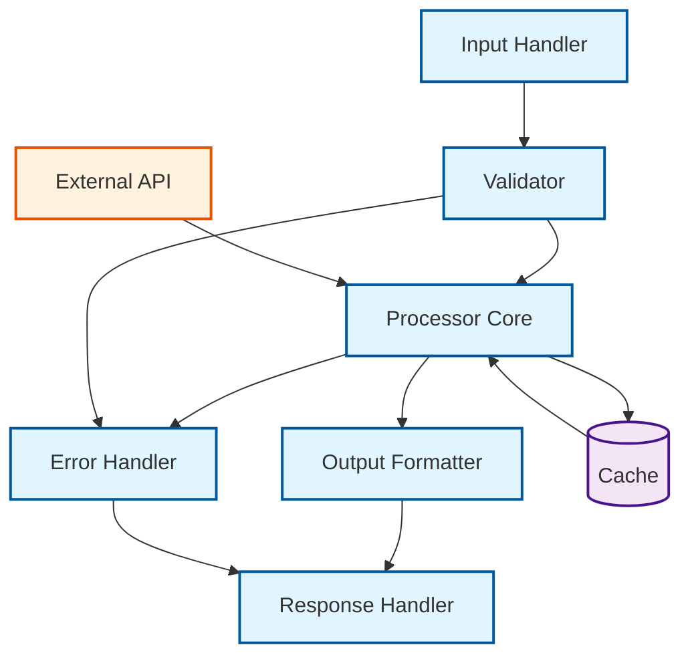
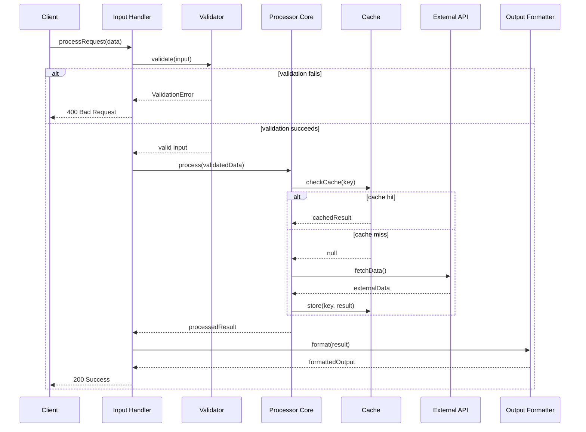

# [Feature Name] Specification

## 1. Description

### Overview

[Brief description of what this feature does and why it exists]

### Business Context

[Why this feature is needed, what problem it solves]

### Success Criteria

- [Criterion 1: e.g., Process 1000 records/minute]
- [Criterion 2: e.g., 99.9% uptime requirement]
- [Criterion 3: e.g., Sub-200ms response time]

## 2. Architecture Decision Records

### Key Decisions

- **[ADR-XXX](../adrs/ADR-XXX.md):** [Brief description of relevant
  architectural decision]
- **[ADR-YYY](../adrs/ADR-YYY.md):** [Brief description of relevant
  architectural decision]

### Trade-offs Made

[Important trade-offs or compromises in this design]

## 3. API Blueprint

### Input Contract

```typescript
interface FeatureInput {
  // Define input structure
  data: string;
  options?: FeatureOptions;
}

interface FeatureOptions {
  // Optional parameters
  timeout?: number;
  retries?: number;
}
```

### Output Contract

```typescript
interface FeatureOutput {
  // Define output structure
  result: ProcessedData;
  metadata: ProcessingMetadata;
}

interface ProcessingMetadata {
  processingTime: number;
  recordsProcessed: number;
  warnings?: string[];
}
```

### JSON Schema

```json
{
  "$id": "https://example.com/schemas/FeatureOutput.json",
  "type": "object",
  "properties": {
    "result": { "$ref": "#/definitions/ProcessedData" },
    "metadata": { "$ref": "#/definitions/ProcessingMetadata" }
  },
  "required": ["result", "metadata"],
  "definitions": {
    "ProcessedData": {
      "type": "object",
      "properties": {}
    }
  }
}
```

### Error Conditions

| Error Code             | Description             | HTTP Status | Retry Strategy      |
| ---------------------- | ----------------------- | ----------- | ------------------- |
| `INVALID_INPUT`        | Input validation failed | 400         | No retry            |
| `PROCESSING_TIMEOUT`   | Operation timed out     | 408         | Exponential backoff |
| `RESOURCE_UNAVAILABLE` | Dependency unavailable  | 503         | Linear retry        |

## 4. Expected Output

### Success Response Example

```json
{
  "result": {
    "processedData": "example_output"
  },
  "metadata": {
    "processingTime": 150,
    "recordsProcessed": 1,
    "warnings": []
  }
}
```

### Error Response Example

```json
{
  "error": {
    "code": "INVALID_INPUT",
    "message": "Required field 'data' is missing",
    "details": {
      "field": "data",
      "expected": "string"
    }
  }
}
```

## 5. Component Architecture



## 6. Sequence Diagram



## 7. Test Scenarios

| Test Case             | Input             | Expected Output       | Error Conditions               | Notes                 |
| --------------------- | ----------------- | --------------------- | ------------------------------ | --------------------- |
| **Happy Path**        | Valid data object | Successful processing | None                           | Standard success case |
| **Empty Input**       | `""`              | ValidationError       | `INVALID_INPUT`                | Should fail fast      |
| **Large Dataset**     | 10MB payload      | Successful processing | Potential `PROCESSING_TIMEOUT` | Performance test      |
| **Malformed Data**    | Invalid JSON      | ValidationError       | `INVALID_INPUT`                | Error handling        |
| **External API Down** | Valid data        | ServiceError          | `RESOURCE_UNAVAILABLE`         | Resilience test       |
| **Cache Disabled**    | Valid data        | Successful processing | None                           | Fallback behavior     |

### Performance Requirements

- **Response Time:** < 200ms for 95th percentile
- **Throughput:** 1000 requests/second sustained
- **Memory Usage:** < 512MB per instance
- **CPU Usage:** < 80% under normal load

## 8. Dependencies & Constraints

### Runtime Dependencies

- **Node.js:** >= 18.0.0
- **External APIs:**
  - Service A API v2.1+
  - Service B API v1.5+
- **Database:** PostgreSQL 12+ or compatible
- **Cache:** Redis 6.0+ (optional but recommended)

### Build Dependencies

- **TypeScript:** ^5.0.0
- **Jest:** ^29.0.0 (testing)
- **ESLint:** ^8.0.0 (linting)

### Infrastructure Constraints

- **Memory:** Minimum 512MB, Recommended 1GB
- **CPU:** 2+ cores for production workloads
- **Network:** Outbound HTTPS access required
- **Storage:** 100MB for logs and temporary files

### Security Requirements

- All external API calls must use HTTPS
- Input validation required for all endpoints
- Rate limiting: 100 requests/minute per client
- Audit logging for all processing operations

## 9. Implementation Notes

### For AI Agents

- **Preferred Patterns:** Use functional programming style with immutable data
  structures
- **Error Handling:** Always wrap external API calls in try-catch with specific
  error types
- **Logging:** Use structured logging with correlation IDs
- **Testing:** Generate unit tests with at least 80% coverage, include edge
  cases from test scenarios table
- **Documentation:** Auto-generate API docs from TypeScript interfaces

### Code Generation Guidelines

```typescript
// Preferred error handling pattern
try {
  const result = await externalService.call(data);
  return { success: true, data: result };
} catch (error) {
  logger.error("External service call failed", {
    error: error.message,
    correlationId,
  });
  throw new ProcessingError("RESOURCE_UNAVAILABLE", error.message);
}
```

### For Developers

- **Code Review Checklist:**
  - [ ] All inputs validated according to JSON schema
  - [ ] Error scenarios from test table covered
  - [ ] Performance requirements met
  - [ ] Security requirements implemented
  - [ ] Logging and monitoring in place

### Monitoring Requirements

- **Metrics to Track:**
  - Request rate and response times
  - Error rates by error code
  - External dependency health
  - Cache hit/miss ratios
- **Alerts:**
  - Error rate > 5%
  - Response time > 500ms (95th percentile)
  - External dependency failures

## 10. Migration & Rollout

### Feature Flags

- `feature.new_processor.enabled` - Enable new processing logic
- `feature.cache.enabled` - Enable/disable caching layer

### Rollout Plan

1. **Phase 1:** Deploy with feature flag off, validate deployment
2. **Phase 2:** Enable for 10% of traffic, monitor metrics
3. **Phase 3:** Gradual rollout to 50%, then 100%
4. **Phase 4:** Remove feature flags after 2 weeks stable operation

### Rollback Strategy

- Feature flags allow instant rollback
- Database migrations are backward compatible
- Previous version artifacts retained for 30 days

---

## Metadata for Automation

```yaml
# CI/CD Integration
build:
  test_coverage_threshold: 80
  performance_test_required: true
  security_scan_required: true

# Monitoring
alerts:
  - metric: "error_rate"
    threshold: 0.05
    duration: "5m"
  - metric: "response_time_p95"
    threshold: 500
    duration: "2m"

# Documentation
auto_generate:
  - api_docs: true
  - test_reports: true
  - performance_reports: true
```
