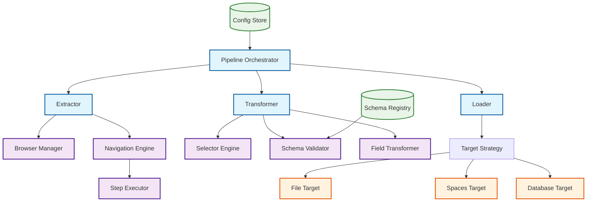
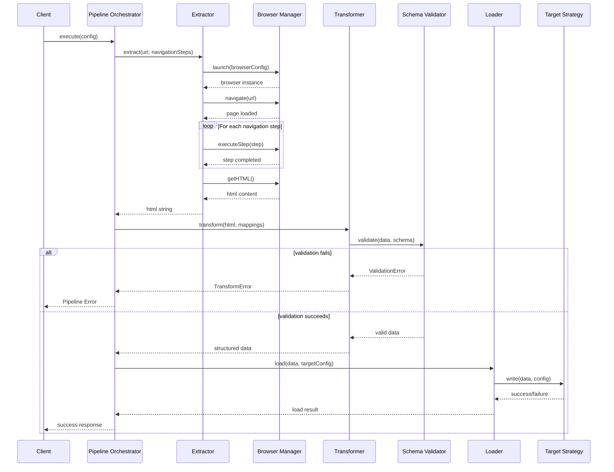

# ETL-Based Web Scraping Pipeline Specification

## 1. Description

### Overview

A modular web scraping pipeline that separates extraction, transformation, and
loading concerns into distinct, configurable, and testable components. The
pipeline takes a URL as input, performs configurable navigation steps, extracts
HTML content, transforms it into structured JSON data, and loads it to
configurable target destinations.

### Business Context

The current monolithic scraper implementation is difficult to maintain, test,
and extend. By implementing an ETL architecture, we can:

- Support multiple output targets (files, cloud storage, databases)
- Reuse extraction logic across different data transformations
- Test each component in isolation
- Scale different pipeline stages independently
- Easily debug and monitor each stage

### Success Criteria

- Process web pages with 100+ items in under 30 seconds
- Support both single item and list extraction patterns
- Support switching between FileTarget and DigitalOceanSpaces through
  configuration
- Achieve 95% test coverage across all pipeline components
- Handle network failures gracefully with configurable retry logic
- Transform extracted HTML to valid JSON schema with 99% accuracy

## 2. Architecture Decision Records

### Key Decisions

- **[ADR-001](../architecture-decision-records/ADR-001-etl-scraper-architecture.md):**
  ETL-Based Scraper Architecture - Separation of extraction, transformation, and
  loading concerns

### Trade-offs Made

- Increased complexity (3 components vs 1) in exchange for modularity and
  testability
- Higher memory usage (intermediate data structures) for better error isolation
  and debugging

## 3. API Blueprint

### Input Contract

```typescript
interface PipelineInput {
  url: string;
  extractorConfig: ExtractorConfig;
  transformerConfig: TransformerConfig;
  loaderConfig: LoaderConfig;
}

interface ExtractorConfig {
  navigationSteps: NavigationStep[];
  timeout: number;
  viewport: { width: number; height: number };
  headless: boolean;
}

interface NavigationStep {
  type: "click" | "wait" | "scroll" | "fill";
  selector?: string;
  value?: string;
  timeout?: number;
  maxAttempts?: number;
}

// Base configuration shared by both patterns
interface BaseTransformerConfig {
  schema: string; // JSON schema name/identifier
  fieldMappings: Record<string, FieldMapping>;
  validationRules?: ValidationRule[];
}

// For single items (articles, product details, etc.)
interface ItemTransformerConfig extends BaseTransformerConfig {
  extractionPattern: "item";
  // fieldMappings directly map to the single item
}

// For collections (lists, search results, etc.)
interface ListTransformerConfig extends BaseTransformerConfig {
  extractionPattern: "list";
  containerSelector: string; // ".search-results", ".item-listing"
  itemSelector: string; // ".result-item", ".list-item"
  pagination?: PaginationConfig;
  // fieldMappings are relative to each item within the container
}

interface PaginationConfig {
  strategy: "click" | "scroll" | "url-pattern";
  selector?: string; // for click strategy
  maxPages?: number;
  waitCondition?: string; // selector to wait for after pagination
}

// Discriminated union
type TransformerConfig = ItemTransformerConfig | ListTransformerConfig;

interface FieldMapping {
  selector: string;
  attribute?: "text" | "href" | "src" | "title" | string; // Allow custom attributes
  transformer?:
    | "date"
    | "price"
    | "url"
    | "html-to-text"
    | "number"
    | "boolean"
    | "trim";
  required?: boolean;
  defaultValue?: unknown; // Default value if extraction fails
  multiple?: boolean; // Extract multiple values as array
}

interface LoaderConfig {
  target: "file" | "digitalocean-spaces" | "database";
  targetConfig: FileTargetConfig | SpacesTargetConfig | DatabaseTargetConfig;
}
```

### Configuration Examples

#### Nested Field Mapping Support

The pipeline supports dot-notation for creating nested object structures:

```typescript
// Example: Advanced product extraction with nested structure
const advancedProductConfig: ItemTransformerConfig = {
  extractionPattern: "item",
  schema: "advanced-product",
  fieldMappings: {
    // Basic product information
    "basic.title": {
      selector: "h1.product-title",
      attribute: "text",
      required: true,
    },
    "basic.sku": {
      selector: "[data-sku]",
      attribute: "data-sku",
      required: true,
    },
    "basic.brand": { selector: ".brand", attribute: "text" },
    "basic.category": {
      selector: "[data-category]",
      attribute: "data-category",
    },

    // Pricing information with type transformations
    "pricing.currentPrice": {
      selector: "[data-current-price]",
      attribute: "data-current-price",
      transformer: "number",
      required: true,
    },
    "pricing.originalPrice": {
      selector: "[data-original-price]",
      attribute: "data-original-price",
      transformer: "number",
    },
    "pricing.currency": {
      selector: "[data-currency]",
      attribute: "data-currency",
      defaultValue: "USD",
    },
    "pricing.discount.percent": {
      selector: "[data-discount-percent]",
      attribute: "data-discount-percent",
      transformer: "number",
    },

    // Availability information
    "availability.status": {
      selector: "[data-stock-status]",
      attribute: "data-stock-status",
      defaultValue: "unknown",
    },
    "availability.stockLevel": {
      selector: "[data-stock-level]",
      attribute: "data-stock-level",
      transformer: "number",
    },
    "availability.estimatedDelivery": {
      selector: ".estimated-delivery",
      attribute: "datetime",
    },

    // Technical specifications as nested object
    "specifications.processor": {
      selector: "[data-spec='cpu']",
      attribute: "text",
    },
    "specifications.memory": {
      selector: "[data-spec='ram']",
      attribute: "text",
    },
    "specifications.storage": {
      selector: "[data-spec='storage']",
      attribute: "text",
    },
    "specifications.display": {
      selector: "[data-spec='display']",
      attribute: "text",
    },

    // Arrays using multiple flag
    features: {
      selector: "[data-feature]",
      attribute: "text",
      multiple: true,
    },
    "images.gallery": {
      selector: ".thumbnail",
      attribute: "src",
      multiple: true,
    },

    // Review metrics
    "reviews.averageRating": {
      selector: "[data-rating]",
      attribute: "data-rating",
      transformer: "number",
    },
    "reviews.totalReviews": {
      selector: "[data-review-count]",
      attribute: "data-review-count",
      transformer: "number",
    },
  },
};
```

The resulting extracted data will have the nested structure:

```json
{
  "basic": {
    "title": "UltraBook Pro 15\" - High Performance Laptop",
    "sku": "TST-LT-2024-001",
    "brand": "TechStore",
    "category": "electronics/laptops"
  },
  "pricing": {
    "currentPrice": 999.99,
    "originalPrice": 1299.99,
    "currency": "USD",
    "discount": {
      "percent": 23
    }
  },
  "availability": {
    "status": "low-stock",
    "stockLevel": 5,
    "estimatedDelivery": "2024-01-15"
  },
  "specifications": {
    "processor": "Intel Core i7-12700H",
    "memory": "16GB DDR4-3200",
    "storage": "512GB PCIe NVMe SSD",
    "display": "15.6\" 4K OLED"
  },
  "features": ["Latest Intel processor", "16GB DDR4 RAM", "512GB NVMe SSD"],
  "images": {
    "gallery": ["/images/laptop-side.jpg", "/images/laptop-keyboard.jpg"]
  },
  "reviews": {
    "averageRating": 4.6,
    "totalReviews": 1847
  }
}
```

#### Item Extraction Configuration

```typescript
// Example: Extracting a single article page
const articleExtractionConfig: ItemTransformerConfig = {
  extractionPattern: "item",
  schema: "article",
  fieldMappings: {
    title: { selector: "h1.main-title", attribute: "text", required: true },
    publishedDate: {
      selector: "time.publish-date",
      attribute: "datetime",
      transformer: "date",
    },
    content: { selector: ".article-content", attribute: "text" },
    metadata: { selector: ".article-author", attribute: "text" },
    sourceUrl: { selector: "link[rel='canonical']", attribute: "href" },
    imageUrl: { selector: ".featured-image img", attribute: "src" },
  },
  validationRules: [
    { field: "title", minLength: 5 },
    { field: "content", minLength: 100 },
  ],
};
```

#### List Extraction Configuration

```typescript
// Example: Extracting a list of search results with pagination
const searchResultsConfig: ListTransformerConfig = {
  extractionPattern: "list",
  schema: "search-result",
  containerSelector: ".search-results",
  itemSelector: ".result-item",
  fieldMappings: {
    title: { selector: ".result-title a", attribute: "text", required: true },
    metadata: { selector: ".result-meta", attribute: "text" },
    sourceUrl: { selector: ".result-title a", attribute: "href" },
    content: { selector: ".result-snippet", attribute: "text" },
  },
  pagination: {
    strategy: "click",
    selector: "button.load-more",
    maxPages: 5,
    waitCondition: ".result-item:last-child",
  },
  validationRules: [{ field: "title", minLength: 3 }],
};
```

### Output Contract

```typescript
interface PipelineOutput {
  success: boolean;
  result?: PipelineResult;
  error?: PipelineError;
  metadata: PipelineMetadata;
}

interface PipelineResult {
  extractedHtml: string;
  transformedData: Record<string, unknown>[];
  loadedTo: string; // target location/identifier
}

interface PipelineError {
  stage: "extractor" | "transformer" | "loader";
  code: string;
  message: string;
  details?: Record<string, unknown>;
}

interface PipelineMetadata {
  executionTime: number;
  recordsProcessed: number;
  extractorMetrics: ExtractorMetrics;
  transformerMetrics: TransformerMetrics;
  loaderMetrics: LoaderMetrics;
}
```

### JSON Schema

```json
{
  "$id": "https://example.com/schemas/GenericItem.json",
  "type": "object",
  "properties": {
    "title": { "type": "string", "minLength": 1 },
    "publishedDate": { "type": "string", "format": "date-time" },
    "content": { "type": "string" },
    "metadata": { "type": "string" },
    "sourceUrl": { "type": "string", "format": "uri" },
    "imageUrl": { "type": "string", "format": "uri" },
    "category": { "type": "string" },
    "numericValue": {
      "type": "object",
      "properties": {
        "amount": { "type": "number", "minimum": 0 },
        "unit": { "type": "string" }
      }
    }
  },
  "required": ["title"],
  "additionalProperties": false
}
```

### Error Conditions

| Error Code                 | Description                         | Stage       | Retry Strategy      |
| -------------------------- | ----------------------------------- | ----------- | ------------------- |
| `NAVIGATION_TIMEOUT`       | Navigation step exceeded timeout    | Extractor   | Exponential backoff |
| `ELEMENT_NOT_FOUND`        | Required selector not found         | Extractor   | Linear retry        |
| `CONTAINER_NOT_FOUND`      | List container selector not found   | Extractor   | Linear retry        |
| `PAGINATION_FAILED`        | Pagination step failed              | Extractor   | Linear retry        |
| `INVALID_HTML`             | Extracted HTML is malformed         | Transformer | No retry            |
| `SCHEMA_VALIDATION_FAILED` | Output doesn't match schema         | Transformer | No retry            |
| `EXTRACTION_PATTERN_ERROR` | Invalid extraction pattern config   | Transformer | No retry            |
| `TARGET_UNAVAILABLE`       | Cannot reach target destination     | Loader      | Exponential backoff |
| `PERMISSION_DENIED`        | Insufficient permissions for target | Loader      | No retry            |

## 4. Expected Output

### Success Response Example

```json
{
  "success": true,
  "result": {
    "extractedHtml": "<html>...</html>",
    "transformedData": [
      {
        "title": "Sample Article Title",
        "publishedDate": "2025-08-24T14:30:00Z",
        "content": "Article content goes here...",
        "metadata": "Technology",
        "sourceUrl": "https://example.com/article/1",
        "category": "news"
      },
      {
        "title": "Another Item Title",
        "publishedDate": "2025-08-25T09:15:00Z",
        "content": "Second item content...",
        "metadata": "Business",
        "sourceUrl": "https://example.com/article/2",
        "category": "news"
      }
    ],
    "loadedTo": "file://output/extracted_items_2025-08-25.json"
  },
  "metadata": {
    "executionTime": 15000,
    "recordsProcessed": 42,
    "extractorMetrics": {
      "navigationSteps": 3,
      "pageLoadTime": 2800,
      "paginationSteps": 2
    },
    "transformerMetrics": {
      "validationErrors": 0,
      "fieldExtractionTime": 1800,
      "extractionPattern": "list"
    },
    "loaderMetrics": {
      "uploadTime": 450,
      "fileSize": 18400
    }
  }
}
```

### Error Response Example

```json
{
  "success": false,
  "error": {
    "stage": "extractor",
    "code": "PAGINATION_FAILED",
    "message": "Pagination step 'click[.load-more-btn]' failed after 3 attempts",
    "details": {
      "step": 2,
      "selector": "button.load-more-btn",
      "attempts": 3,
      "lastError": "Element not clickable"
    }
  },
  "metadata": {
    "executionTime": 45000,
    "recordsProcessed": 25
  }
}
```

## 5. Component Architecture



## 6. Sequence Diagram



## 7. Test Scenarios

### Mock HTML Test Fixtures

The pipeline should be tested against standardized mock HTML files that
represent common extraction patterns:

- **`mock-item.html`**: Single item extraction (article, product detail)
- **`mock-list-basic.html`**: Simple list with static pagination
- **`mock-list-infinite.html`**: List with infinite scroll/load more
- **`mock-list-url-pagination.html`**: List with URL-based pagination
- **`mock-empty-list.html`**: Container exists but no items
- **`mock-malformed.html`**: Invalid/incomplete HTML structure

| Test Case              | Input                         | Expected Output            | Error Conditions           | Notes                    |
| ---------------------- | ----------------------------- | -------------------------- | -------------------------- | ------------------------ |
| **Item Extraction**    | mock-item.html + item config  | Single item JSON           | None                       | Basic singleton pattern  |
| **List Extraction**    | mock-list-basic.html + config | Multiple items JSON array  | None                       | Basic collection pattern |
| **Pagination Click**   | mock-list-infinite.html       | All paginated items        | None                       | Load more button test    |
| **Infinite Scroll**    | mock-list-infinite.html       | Progressive loading        | None                       | Scroll-based pagination  |
| **Empty Container**    | mock-empty-list.html          | Empty results array        | None                       | Edge case handling       |
| **Missing Container**  | mock-item.html + list config  | Container not found error  | `CONTAINER_NOT_FOUND`      | Configuration mismatch   |
| **Navigation Timeout** | Slow loading mock page        | Navigation timeout error   | `NAVIGATION_TIMEOUT`       | Resilience test          |
| **Invalid Schema**     | Malformed field mapping       | Schema validation error    | `SCHEMA_VALIDATION_FAILED` | Configuration validation |
| **Target Unavailable** | Offline target service        | Load failure error         | `TARGET_UNAVAILABLE`       | Error propagation        |
| **Large Dataset**      | 1000+ items mock page         | All items extracted        | Potential memory issues    | Performance test         |
| **Network Failure**    | Intermittent connectivity     | Retry then success/failure | Various network errors     | Retry logic test         |

### Performance Requirements

- **Extraction Time:** < 30 seconds for 100+ items
- **Memory Usage:** < 256MB peak during processing
- **Transformation Rate:** 1000+ records/second
- **Load Time:** < 5 seconds to any target

## 8. Dependencies & Constraints

### Runtime Dependencies

- **Node.js:** >= 18.0.0
- **Playwright:** ^1.40.0 (for browser automation)
- **JSON Schema Libraries:** ajv ^8.12.0
- **File System:** Built-in fs/promises
- **Cloud Storage:** AWS SDK or DigitalOcean Spaces API

### Build Dependencies

- **TypeScript:** ^5.0.0
- **Jest:** ^29.0.0 (testing)
- **ESLint:** ^8.0.0 (linting)

### Infrastructure Constraints

- **Memory:** Minimum 512MB for browser automation
- **CPU:** 2+ cores recommended for parallel processing
- **Network:** Outbound HTTPS access required
- **Storage:** Variable based on target configuration

### Security Requirements

- Browser automation in sandboxed environment
- Input validation for all configuration parameters
- Secure credential storage for cloud targets
- Rate limiting to respect target site policies

## 9. Implementation Notes

### For AI Agents

- **Extractor Pattern:** Use Page Object Model for navigation steps
- **Error Handling:** Implement Result<T, E> pattern for typed error propagation
- **Configuration:** Use builder pattern for complex configurations
- **Testing:** Generate comprehensive unit tests for each component with mocked
  dependencies
- **Memory Management:** Dispose browser instances properly to prevent memory
  leaks

### Code Generation Guidelines

```typescript
// Preferred error handling pattern
interface Result<T, E> {
  success: boolean;
  data?: T;
  error?: E;
}

// Item extraction configuration example
const itemConfig: ItemTransformerConfig = {
  extractionPattern: "item",
  schema: "article",
  fieldMappings: {
    title: { selector: "h1.article-title", attribute: "text" },
    publishedDate: { selector: "time.published", transformer: "date" },
    content: { selector: ".article-body", attribute: "text" },
  },
};

// List extraction configuration example
const listConfig: ListTransformerConfig = {
  extractionPattern: "list",
  schema: "search-result",
  containerSelector: ".results-container",
  itemSelector: ".result-item",
  fieldMappings: {
    title: { selector: ".item-title", attribute: "text" },
    metadata: { selector: ".item-meta", attribute: "text" },
    sourceUrl: { selector: ".item-link", attribute: "href" },
  },
  pagination: {
    strategy: "click",
    selector: ".load-more-btn",
    maxPages: 10,
    waitCondition: ".result-item",
  },
};

// Extractor implementation pattern
async function extract(
  config: ExtractorConfig
): Promise<Result<string, ExtractorError>> {
  try {
    const browser = await launchBrowser(config);
    const html = await performNavigation(browser, config.navigationSteps);
    return { success: true, data: html };
  } catch (error) {
    return {
      success: false,
      error: new ExtractorError("NAVIGATION_FAILED", error.message),
    };
  }
}
```

### For Developers

- **Configuration Management:** Use environment variables for target-specific
  settings
- **Pipeline Orchestration:** Implement simple sequential execution with proper
  error handling
- **Monitoring:** Add structured logging with correlation IDs
- **Schema Management:** Version control JSON schemas and validate compatibility

### Monitoring Requirements

- **Metrics to Track:**
  - Pipeline execution time per stage
  - Success/failure rates by error type
  - Memory usage during processing
  - Target-specific metrics (upload times, file sizes)
- **Alerts:**
  - Pipeline failure rate > 10%
  - Extraction time > 60 seconds
  - Memory usage > 80% of available

## 10. Migration & Rollout

### Feature Flags

- `pipeline.etl.enabled` - Enable new ETL pipeline
- `pipeline.extractor.retries.enabled` - Enable retry logic
- `pipeline.loader.digitalocean.enabled` - Enable DigitalOcean Spaces loader

### Rollout Plan

1. **Phase 1:** Implement core pipeline components with file target only
2. **Phase 2:** Add cloud storage targets and retry logic
3. **Phase 3:** Replace existing monolithic scraper in test environment
4. **Phase 4:** Production deployment with gradual traffic migration

### Rollback Strategy

- Feature flags allow instant fallback to monolithic scraper
- Pipeline components are backwards compatible with existing configs
- Data formats remain consistent during transition

---

## Metadata for Automation

```yaml
# CI/CD Integration
build:
  test_coverage_threshold: 95
  performance_test_required: true
  security_scan_required: true

# Monitoring
alerts:
  - metric: "pipeline_failure_rate"
    threshold: 0.10
    duration: "5m"
  - metric: "extraction_time"
    threshold: 60
    duration: "1m"

# Documentation
auto_generate:
  - api_docs: true
  - test_reports: true
  - performance_reports: true
```
