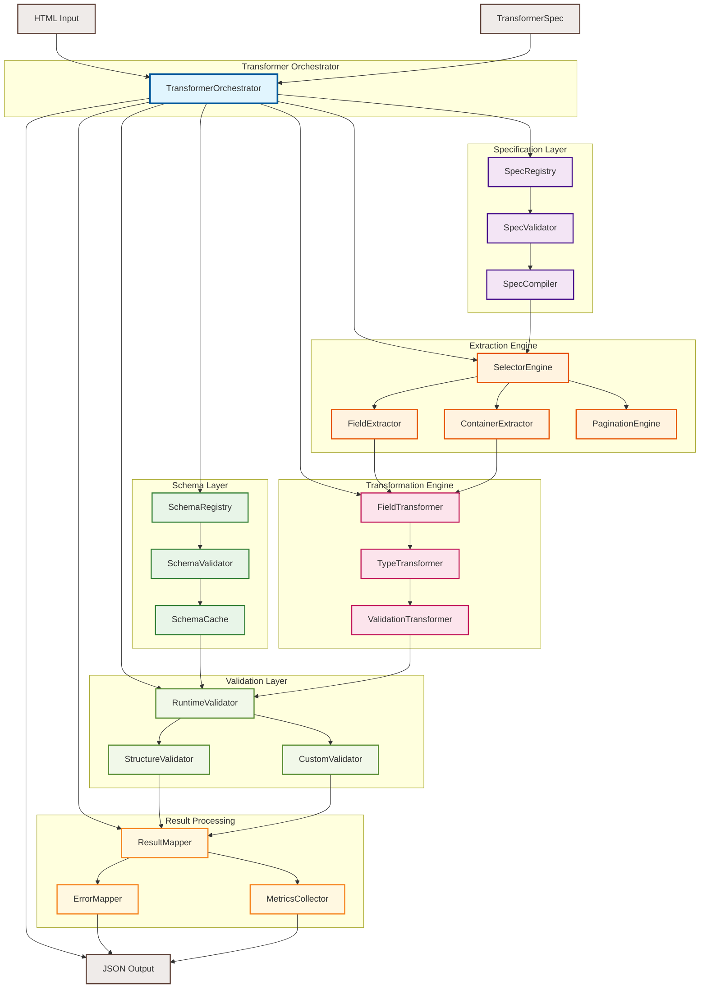
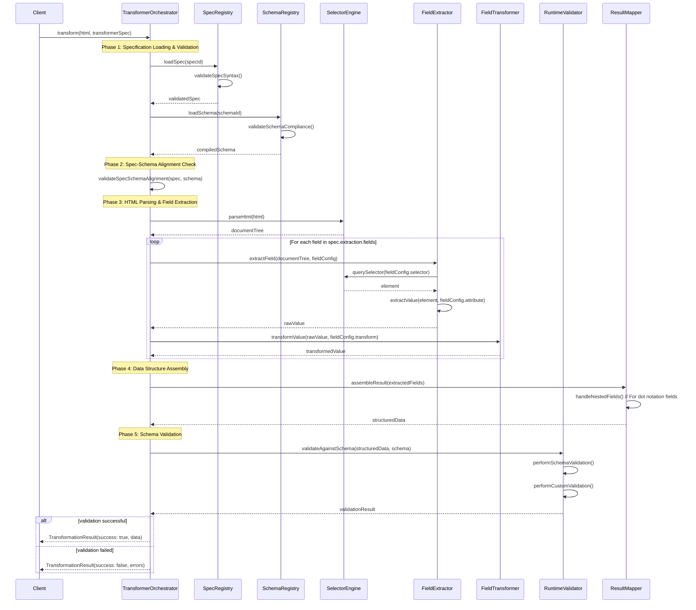
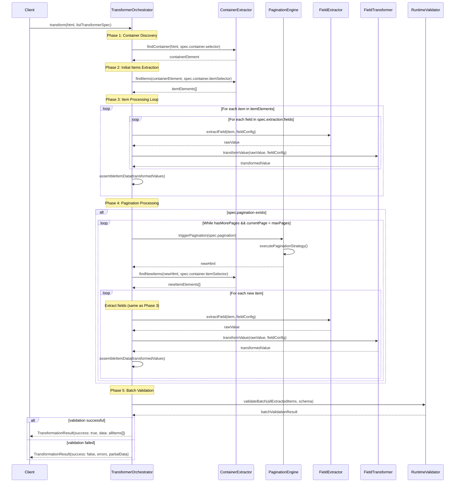
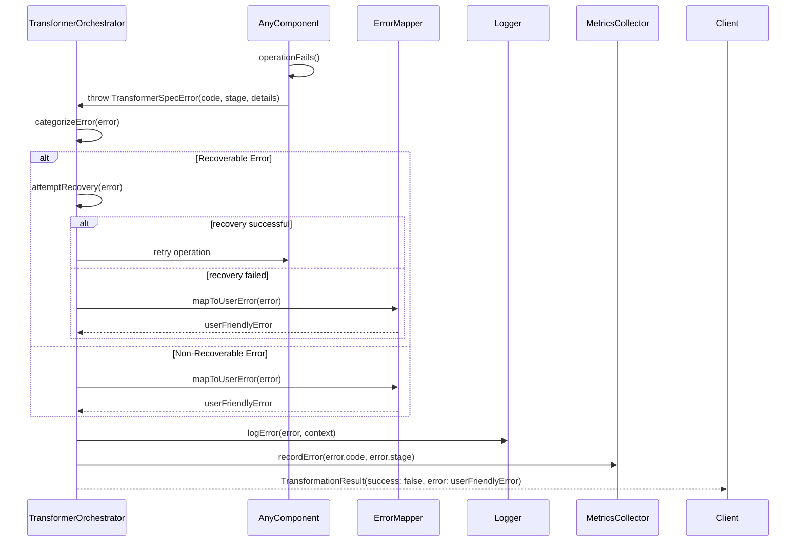
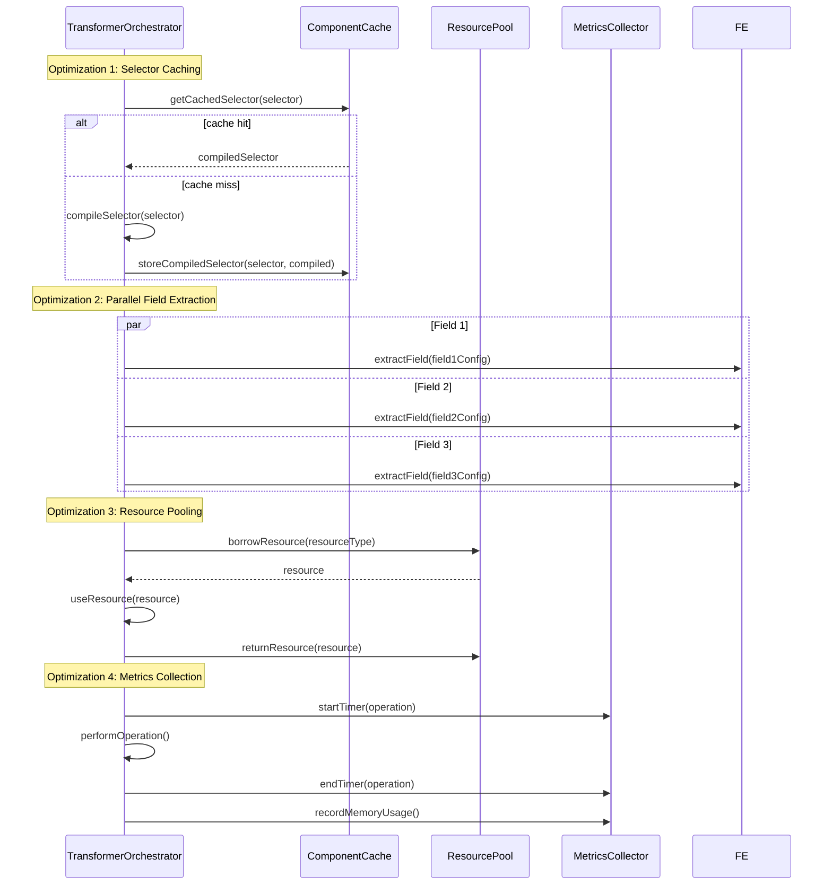

# Schema-Aware HTML Transformer Specification

## 1. Description

### Overview

A next-generation HTML transformation system that eliminates duplication between
JSON schemas and field mapping configurations through schema-aware transformer
specifications. The system provides compile-time type safety, runtime
validation, and enhanced developer experience while maintaining standards
compliance and architectural separation of concerns.

### Business Context

The current transformer implementation suffers from:

- **Duplication**: Property names repeated across schemas and field mappings
- **Sync Risk**: Schema and field mapping configurations can diverge
- **Runtime-Only Validation**: Type mismatches only caught during execution
- **Error-Prone Configuration**: No compile-time validation of field mappings

This specification addresses these issues by introducing **Transformer
Specifications** that:

- Reference pure JSON schemas for data validation
- Provide type-safe extraction configuration
- Ensure compile-time alignment between schemas and field mappings
- Maintain clean separation between validation and extraction concerns

### Success Criteria

- **Zero Duplication**: Eliminate repeated property names across configuration
  files
- **Compile-Time Safety**: Catch field mapping errors before runtime
- **Enhanced DX**: Provide IDE autocomplete and validation for transformer
  configurations
- **Standards Compliance**: Maintain valid JSON Schema specifications
- **Backward Compatibility**: Support existing transformer configurations during
  migration
- **Performance**: No degradation in transformation speed or memory usage

## 2. Architecture Evolution

### Current Architecture Problems

```typescript
// ❌ Current: Duplication and sync issues
// schema.json
{
  "properties": {
    "title": { "type": "string" },
    "price": { "type": "number" }
  }
}

// config.ts - Property names repeated
{
  fieldMappings: {
    title: { selector: "h1" },     // Duplicate "title"
    price: { selector: ".price" }  // Duplicate "price"
  }
}
```

### Proposed Architecture Solution

```typescript
// ✅ Enhanced: Schema-aware transformer specifications
// schemas/product.schema.json - Pure, reusable
{
  "properties": {
    "title": { "type": "string" },
    "price": { "type": "number" }
  }
}

// transformer-specs/product.spec.ts - Type-safe extraction config
export const productTransformerSpec: TransformerSpec<ProductSchema> = {
  schema: "product",
  extraction: {
    pattern: "item",
    fields: {
      title: { selector: "h1", transform: "trim" },    // ✅ Typed against schema
      price: { selector: ".price", transform: "currency" } // ✅ Compile-time validated
    }
  }
};
```

## 3. Core Types and Interfaces

### Schema-Aware Transformer Specification

```typescript
/**
 * Schema-aware transformer specification that ensures type safety
 * between JSON schemas and field extraction configurations
 */
interface TransformerSpec<TSchema = Record<string, unknown>> {
  /** Reference to JSON schema identifier */
  readonly schema: string;

  /** Extraction configuration with compile-time validation */
  readonly extraction: ExtractionConfig<TSchema>;

  /** Optional validation rules beyond schema validation */
  readonly validation?: ValidationConfig;

  /** Optional transformation options */
  readonly options?: TransformerOptions;

  /** Metadata for documentation and tooling */
  readonly metadata?: TransformerMetadata;
}

/**
 * Extraction configuration with type-safe field mappings
 */
interface ExtractionConfig<TSchema> {
  /** Extraction pattern: single item or list */
  readonly pattern: ExtractionPattern;

  /** Container and item selectors for list extraction */
  readonly container?: ContainerConfig;

  /** Field mappings that must match schema properties */
  readonly fields: SchemaFieldMappings<TSchema>;

  /** Optional pagination configuration for lists */
  readonly pagination?: PaginationConfig;
}

/**
 * Type-safe field mappings that enforce schema property alignment
 */
type SchemaFieldMappings<TSchema> = {
  [K in keyof TSchema]: FieldExtractionConfig;
} & {
  // Allow additional nested fields using dot notation
  [key: string]: FieldExtractionConfig;
};

/**
 * Enhanced field extraction configuration
 */
interface FieldExtractionConfig {
  /** CSS selector for extracting the field */
  readonly selector: string;

  /** HTML attribute to extract (defaults to "text") */
  readonly attribute?: ElementAttribute;

  /** Transformation function to apply */
  readonly transform?: FieldTransform;

  /** Whether field is required (overrides schema requirement) */
  readonly required?: boolean;

  /** Default value if extraction fails */
  readonly defaultValue?: unknown;

  /** Extract multiple values as array */
  readonly multiple?: boolean;

  /** Validation rules specific to extraction */
  readonly validation?: FieldValidationRule[];
}
```

### Enhanced Type System

```typescript
/**
 * Extraction patterns supported by the transformer
 */
type ExtractionPattern = "item" | "list";

/**
 * Container configuration for list extraction
 */
interface ContainerConfig {
  /** Selector for the container element */
  readonly selector: string;

  /** Selector for individual items within container */
  readonly itemSelector: string;

  /** Optional minimum number of items expected */
  readonly minItems?: number;

  /** Optional maximum number of items to extract */
  readonly maxItems?: number;
}

/**
 * Enhanced element attributes with better type safety
 */
type ElementAttribute =
  | "text"
  | "innerText"
  | "innerHTML"
  | "href"
  | "src"
  | "title"
  | "alt"
  | "value"
  | `data-${string}` // Type-safe data attributes
  | `aria-${string}` // Type-safe ARIA attributes
  | string; // Allow any custom attribute

/**
 * Enhanced field transformation functions
 */
type FieldTransform =
  | "trim"
  | "lowercase"
  | "uppercase"
  | "number"
  | "boolean"
  | "date"
  | "currency"
  | "url"
  | "email"
  | "html-to-text"
  | "remove-whitespace"
  | `regex:${string}` // Custom regex transformations
  | `replace:${string}:${string}` // String replacement transformations
  | string; // Allow custom transformation functions

/**
 * Pagination configuration for list extraction
 */
interface PaginationConfig {
  /** Pagination strategy */
  readonly strategy: PaginationStrategy;

  /** Selector for pagination trigger (click strategy) */
  readonly selector?: string;

  /** Maximum number of pages to process */
  readonly maxPages?: number;

  /** Wait condition after pagination */
  readonly waitCondition?: WaitCondition;

  /** Delay between pagination steps (ms) */
  readonly delay?: number;
}

type PaginationStrategy =
  | "click"
  | "scroll"
  | "url-pattern"
  | "infinite-scroll";

interface WaitCondition {
  /** Selector to wait for */
  readonly selector: string;

  /** Timeout for wait condition */
  readonly timeout?: number;

  /** Whether element should be visible */
  readonly visible?: boolean;
}
```

### Validation and Error Handling

```typescript
/**
 * Validation configuration for transformer specifications
 */
interface ValidationConfig {
  /** Enable strict mode (fail on additional properties) */
  readonly strict?: boolean;

  /** Custom validation rules */
  readonly rules?: ValidationRule[];

  /** Schema validation options */
  readonly schema?: SchemaValidationOptions;
}

/**
 * Field-level validation rules
 */
interface FieldValidationRule {
  /** Rule type */
  readonly type: ValidationRuleType;

  /** Rule parameters */
  readonly params?: Record<string, unknown>;

  /** Custom error message */
  readonly message?: string;
}

type ValidationRuleType =
  | "required"
  | "min-length"
  | "max-length"
  | "pattern"
  | "range"
  | "custom";

/**
 * Enhanced transformer error types
 */
interface TransformerSpecError extends Error {
  readonly code: TransformerErrorCode;
  readonly stage: TransformerStage;
  readonly field?: string;
  readonly details?: Record<string, unknown>;
}

type TransformerErrorCode =
  | "SCHEMA_MISMATCH" // Field mapping doesn't match schema
  | "FIELD_EXTRACTION_FAILED" // Failed to extract field value
  | "TRANSFORMATION_FAILED" // Field transformation failed
  | "VALIDATION_FAILED" // Schema validation failed
  | "CONTAINER_NOT_FOUND" // List container not found
  | "PAGINATION_FAILED" // Pagination step failed
  | "SPEC_INVALID"; // Transformer spec is invalid

type TransformerStage =
  | "specification"
  | "extraction"
  | "transformation"
  | "validation";
```

## 4. Component Architecture

### Transformer System Components

The enhanced transformer system consists of several interconnected components
that work together to provide schema-aware HTML transformation:



### Component Responsibilities

#### **TransformerOrchestrator**

- **Purpose**: Coordinates the entire transformation process
- **Responsibilities**:
  - Load and validate transformer specifications
  - Orchestrate extraction, transformation, and validation phases
  - Handle errors and collect metrics
  - Manage component lifecycle and resource cleanup

#### **Specification Layer**

- **SpecRegistry**: Manages transformer specification loading and caching
- **SpecValidator**: Validates transformer specs against schemas at compile/load
  time
- **SpecCompiler**: Compiles specs into optimized execution plans

#### **Schema Layer**

- **SchemaRegistry**: Loads and manages JSON schemas with version support
- **SchemaValidator**: Performs runtime schema validation of extracted data
- **SchemaCache**: Caches compiled schemas for performance optimization

#### **Extraction Engine**

- **SelectorEngine**: Executes CSS selectors and XPath queries against HTML
- **FieldExtractor**: Extracts individual field values using configured
  selectors
- **ContainerExtractor**: Handles list extraction patterns with container/item
  selectors
- **PaginationEngine**: Manages pagination for list extraction scenarios

#### **Transformation Engine**

- **FieldTransformer**: Applies field-level transformations (trim, currency,
  etc.)
- **TypeTransformer**: Handles type conversions (string to number, date parsing)
- **ValidationTransformer**: Applies field-level validation rules

#### **Validation Layer**

- **RuntimeValidator**: Orchestrates all validation activities
- **StructureValidator**: Validates data structure against JSON schemas
- **CustomValidator**: Executes custom validation rules defined in specs

#### **Result Processing**

- **ResultMapper**: Maps extracted and transformed data to final output
  structure
- **ErrorMapper**: Converts internal errors to user-friendly error messages
- **MetricsCollector**: Gathers performance and execution metrics

### Component Interactions

The components interact through well-defined interfaces that support:

- **Dependency Injection**: Components can be easily replaced for testing
- **Event-Driven Communication**: Components emit events for monitoring and
  debugging
- **Resource Pooling**: Expensive resources (browsers, parsers) are shared
  efficiently
- **Error Boundaries**: Each component handles its own errors and provides
  meaningful context

## 5. Sequence Diagrams

### Item Extraction Flow



### List Extraction Flow with Pagination



### Error Handling Flow



### Performance Optimization Flow



## 6. Implementation Examples

### Basic Item Extraction

```typescript
// schemas/article.schema.json
{
  "$id": "https://project-aurora.com/schemas/article.json",
  "$schema": "http://json-schema.org/draft-07/schema#",
  "type": "object",
  "properties": {
    "title": { "type": "string", "minLength": 1 },
    "publishedDate": { "type": "string", "format": "date-time" },
    "content": { "type": "string" },
    "author": { "type": "string" },
    "category": { "type": "string" },
    "tags": { "type": "array", "items": { "type": "string" } }
  },
  "required": ["title", "content"]
}

// transformer-specs/article.spec.ts
import type { TransformerSpec } from "../types.js";
import type { ArticleSchema } from "../schemas/article.schema.js";

export const articleTransformerSpec: TransformerSpec<ArticleSchema> = {
  schema: "article",
  extraction: {
    pattern: "item",
    fields: {
      title: {
        selector: "h1.article-title",
        transform: "trim",
        required: true
      },
      publishedDate: {
        selector: "time.publish-date",
        attribute: "datetime",
        transform: "date"
      },
      content: {
        selector: ".article-content",
        transform: "html-to-text"
      },
      author: {
        selector: ".author-name",
        transform: "trim",
        defaultValue: "Unknown"
      },
      category: {
        selector: "[data-category]",
        attribute: "data-category"
      },
      tags: {
        selector: ".tag",
        multiple: true,
        transform: "trim"
      }
    }
  },
  validation: {
    strict: true,
    rules: [
      { field: "content", type: "min-length", params: { min: 100 } }
    ]
  },
  metadata: {
    description: "Article extraction from blog pages",
    version: "1.0",
    examples: ["https://example.com/blog/article-1"]
  }
};
```

### Advanced List Extraction with Nested Fields

```typescript
// schemas/product.schema.json
{
  "$id": "https://project-aurora.com/schemas/product.json",
  "$schema": "http://json-schema.org/draft-07/schema#",
  "type": "object",
  "properties": {
    "basic": {
      "type": "object",
      "properties": {
        "title": { "type": "string" },
        "brand": { "type": "string" },
        "sku": { "type": "string" }
      }
    },
    "pricing": {
      "type": "object",
      "properties": {
        "currentPrice": { "type": "number" },
        "originalPrice": { "type": "number" },
        "currency": { "type": "string" }
      }
    },
    "availability": {
      "type": "object",
      "properties": {
        "inStock": { "type": "boolean" },
        "stockLevel": { "type": "number" }
      }
    },
    "images": {
      "type": "array",
      "items": { "type": "string", "format": "uri" }
    }
  }
}

// transformer-specs/product-list.spec.ts
export const productListTransformerSpec: TransformerSpec<ProductSchema> = {
  schema: "product",
  extraction: {
    pattern: "list",
    container: {
      selector: ".products-grid",
      itemSelector: ".product-card",
      minItems: 1
    },
    fields: {
      // Nested object fields using dot notation
      "basic.title": {
        selector: ".product-name",
        transform: "trim",
        required: true
      },
      "basic.brand": {
        selector: ".brand",
        transform: "trim"
      },
      "basic.sku": {
        selector: "[data-sku]",
        attribute: "data-sku"
      },

      // Pricing with transformations
      "pricing.currentPrice": {
        selector: ".current-price",
        transform: "currency",
        required: true
      },
      "pricing.originalPrice": {
        selector: ".original-price",
        transform: "currency"
      },
      "pricing.currency": {
        selector: "[data-currency]",
        attribute: "data-currency",
        defaultValue: "USD"
      },

      // Boolean and numeric fields
      "availability.inStock": {
        selector: ".stock-status",
        attribute: "data-in-stock",
        transform: "boolean"
      },
      "availability.stockLevel": {
        selector: ".stock-level",
        transform: "number"
      },

      // Array fields
      images: {
        selector: ".product-image img",
        attribute: "src",
        multiple: true
      }
    },
    pagination: {
      strategy: "click",
      selector: ".load-more-btn",
      maxPages: 5,
      waitCondition: {
        selector: ".product-card:last-child",
        timeout: 5000
      }
    }
  },
  validation: {
    strict: false, // Allow additional properties from dynamic content
    rules: [
      { field: "basic.title", type: "min-length", params: { min: 3 } },
      { field: "pricing.currentPrice", type: "range", params: { min: 0 } }
    ]
  }
};
```

### Schema-First Development Workflow

```typescript
/**
 * Utility function to generate transformer spec templates from JSON schemas
 */
export function generateTransformerSpecTemplate<T>(
  schemaId: string,
  schema: JSONSchema7
): Partial<TransformerSpec<T>> {
  const fields: Record<string, FieldExtractionConfig> = {};

  // Generate field mappings from schema properties
  Object.keys(schema.properties || {}).forEach((prop) => {
    fields[prop] = {
      selector: `[data-${prop}]`, // Default selector pattern
      transform: inferTransformFromType(schema.properties![prop]),
    };
  });

  return {
    schema: schemaId,
    extraction: {
      pattern: "item", // Default to item extraction
      fields: fields as SchemaFieldMappings<T>,
    },
    validation: {
      strict: false,
    },
  };
}

/**
 * Validate transformer spec against referenced schema
 */
export function validateTransformerSpec<T>(
  spec: TransformerSpec<T>,
  schema: JSONSchema7
): ValidationResult {
  const errors: ValidationError[] = [];
  const warnings: ValidationWarning[] = [];

  // Check that all required schema fields have extraction configs
  const requiredFields = schema.required || [];
  const extractionFields = Object.keys(spec.extraction.fields);

  requiredFields.forEach((field) => {
    if (!extractionFields.includes(field)) {
      errors.push({
        code: "MISSING_FIELD_MAPPING",
        message: `Required field '${field}' missing from extraction config`,
        field,
      });
    }
  });

  // Check for extraction fields not in schema
  extractionFields.forEach((field) => {
    const fieldPath = field.split(".");
    if (!hasNestedProperty(schema.properties, fieldPath)) {
      warnings.push({
        code: "UNMAPPED_EXTRACTION_FIELD",
        message: `Extraction field '${field}' not found in schema`,
        field,
      });
    }
  });

  return {
    valid: errors.length === 0,
    errors,
    warnings,
  };
}
```

## 7. Migration Strategy

### Phase 1: Coexistence (Backward Compatibility)

```typescript
/**
 * Enhanced transformer config that supports both legacy and new approaches
 */
interface HybridTransformerConfig {
  // Legacy approach (maintained for compatibility)
  readonly type?: TransformerType;
  readonly schema?: string;
  readonly fieldMappings?: Record<string, FieldMapping>;
  readonly listConfig?: ListTransformerConfig;

  // New approach (preferred)
  readonly spec?: TransformerSpec;

  // Migration utilities
  readonly migration?: {
    readonly mode: "legacy" | "hybrid" | "spec-only";
    readonly warnings?: boolean;
  };
}

/**
 * Migration utility to convert legacy configs to transformer specs
 */
export function migrateLegacyConfig(
  legacyConfig: LegacyTransformerConfig
): TransformerSpec {
  return {
    schema: legacyConfig.schema,
    extraction: {
      pattern: legacyConfig.type,
      container: legacyConfig.listConfig
        ? {
            selector: legacyConfig.listConfig.containerSelector,
            itemSelector: legacyConfig.listConfig.itemSelector,
          }
        : undefined,
      fields: migrateLegacyFieldMappings(legacyConfig.fieldMappings),
    },
  };
}
```

### Phase 2: Enhanced Developer Experience

```typescript
/**
 * VS Code extension / Language Server support
 */
interface TransformerSpecLanguageSupport {
  // Autocomplete for schema properties in field mappings
  provideFieldCompletions(schemaId: string): CompletionItem[];

  // Validation diagnostics for transformer specs
  validateTransformerSpec(spec: TransformerSpec): Diagnostic[];

  // Code actions for common fixes
  provideCodeActions(spec: TransformerSpec): CodeAction[];

  // Hover information for field mappings
  provideHover(field: string): Hover;
}

/**
 * Build-time validation and code generation
 */
interface BuildTimeTools {
  // Generate TypeScript types from transformer specs
  generateTypesFromSpec(spec: TransformerSpec): string;

  // Validate all transformer specs in project
  validateAllSpecs(): ValidationReport;

  // Generate documentation from specs
  generateSpecDocumentation(): Documentation;
}
```

### Phase 3: Advanced Features

```typescript
/**
 * Dynamic transformer spec resolution
 */
interface DynamicTransformerSpec extends TransformerSpec {
  // Conditional field mappings based on page content
  readonly conditionalFields?: ConditionalFieldMapping[];

  // Field mappings that adapt to different page layouts
  readonly adaptiveFields?: AdaptiveFieldMapping[];

  // A/B test different extraction strategies
  readonly variants?: TransformerSpecVariant[];
}

interface ConditionalFieldMapping {
  readonly condition: string; // CSS selector or XPath
  readonly fields: Record<string, FieldExtractionConfig>;
}

interface AdaptiveFieldMapping {
  readonly field: string;
  readonly strategies: FieldExtractionConfig[];
  readonly fallback: FieldExtractionConfig;
}
```

## 8. Testing Strategy

### Unit Testing Framework

```typescript
/**
 * Testing utilities for transformer specifications
 */
export class TransformerSpecTester {
  /**
   * Test transformer spec against mock HTML
   */
  async testSpec<T>(
    spec: TransformerSpec<T>,
    mockHtml: string
  ): Promise<TransformationTestResult<T>> {
    const transformer = new HtmlTransformer();
    const result = await transformer.transform(mockHtml, spec);

    return {
      success: result.success,
      data: result.data,
      errors: result.errors,
      warnings: result.warnings,
      metadata: {
        fieldsExtracted: Object.keys(result.data || {}),
        extractionTime: result.metadata.extractionTime,
        validationTime: result.metadata.validationTime,
      },
    };
  }

  /**
   * Generate test cases from transformer spec
   */
  generateTestCases<T>(spec: TransformerSpec<T>): TestCase[] {
    return [
      this.generateHappyPathTest(spec),
      this.generateMissingFieldsTest(spec),
      this.generateMalformedHtmlTest(spec),
      this.generateEmptyResultsTest(spec),
    ];
  }
}

/**
 * Mock HTML generator for testing
 */
export class MockHtmlGenerator {
  generateFromSpec<T>(spec: TransformerSpec<T>): string {
    // Generate realistic HTML that matches field selectors
    const html = this.createBaseHtml();

    Object.entries(spec.extraction.fields).forEach(([field, config]) => {
      html.appendChild(this.createElementForField(field, config));
    });

    return html.toString();
  }
}
```

### Integration Testing

```typescript
/**
 * End-to-end testing for transformer specifications
 */
export class TransformerSpecE2ETester {
  /**
   * Test transformer spec against real websites
   */
  async testAgainstRealSite<T>(
    spec: TransformerSpec<T>,
    url: string
  ): Promise<E2ETestResult<T>> {
    const extractor = new WebExtractor();
    const transformer = new HtmlTransformer();

    const html = await extractor.extract({ url, navigationSteps: [] });
    const result = await transformer.transform(html, spec);

    return {
      url,
      success: result.success,
      data: result.data,
      performance: {
        extractionTime: result.metadata.extractionTime,
        fieldsFound: this.countExtractedFields(result.data),
        fieldsMissing: this.countMissingFields(spec, result.data),
      },
    };
  }
}
```

## 9. Performance Considerations

### Optimization Strategies

```typescript
/**
 * Performance-optimized transformer spec execution
 */
interface PerformanceOptimizations {
  // Cache compiled selectors for reuse
  readonly selectorCache?: boolean;

  // Parallel field extraction
  readonly parallelExtraction?: boolean;

  // Lazy field evaluation
  readonly lazyFields?: string[];

  // Field extraction priority
  readonly extractionOrder?: string[];

  // Memory optimization for large lists
  readonly batchSize?: number;
}

/**
 * Metrics collection for transformer performance
 */
interface TransformerMetrics {
  readonly specCompilationTime: number;
  readonly fieldExtractionTime: number;
  readonly validationTime: number;
  readonly totalTransformationTime: number;
  readonly memoryUsage: {
    readonly peak: number;
    readonly average: number;
  };
  readonly fieldsProcessed: number;
  readonly cacheHitRate?: number;
}
```

## 10. Future Extensions

### Schema Evolution Support

```typescript
/**
 * Support for schema versioning and backward compatibility
 */
interface VersionedTransformerSpec<T> extends TransformerSpec<T> {
  readonly schemaVersion: string;
  readonly migrations?: SchemaMigration[];
  readonly compatibility?: CompatibilityMode;
}

interface SchemaMigration {
  readonly fromVersion: string;
  readonly toVersion: string;
  readonly fieldMappings: Record<string, string>;
  readonly transformations?: MigrationTransformation[];
}
```

### AI-Assisted Spec Generation

```typescript
/**
 * AI-powered transformer spec generation from examples
 */
interface AISpecGenerator {
  /**
   * Generate transformer spec from example HTML and desired output
   */
  generateFromExample(
    exampleHtml: string,
    desiredOutput: Record<string, unknown>
  ): Promise<TransformerSpec>;

  /**
   * Improve existing spec based on extraction failures
   */
  optimizeSpec<T>(
    spec: TransformerSpec<T>,
    failures: ExtractionFailure[]
  ): Promise<TransformerSpec<T>>;
}
```

---

## Implementation Checklist

### Core Implementation

- [ ] Implement `TransformerSpec<T>` interface with type safety
- [ ] Create schema-aware field mapping validation
- [ ] Build transformer spec parser and executor
- [ ] Implement migration utilities for legacy configs
- [ ] Add comprehensive error handling and reporting

### Developer Experience

- [ ] Create VS Code extension for transformer spec editing
- [ ] Implement build-time validation tools
- [ ] Generate TypeScript types from specs
- [ ] Add CLI tools for spec management
- [ ] Create interactive spec builder UI

### Testing Infrastructure

- [ ] Build transformer spec testing framework
- [ ] Create mock HTML generators
- [ ] Implement performance testing suite
- [ ] Add end-to-end testing utilities
- [ ] Create regression testing framework

### Documentation and Examples

- [ ] Create comprehensive transformer spec guide
- [ ] Build interactive examples and tutorials
- [ ] Document migration path from legacy configs
- [ ] Create best practices documentation
- [ ] Build API reference documentation

---

This specification provides a roadmap for evolving the transformer system to
eliminate duplication, enhance type safety, and improve developer experience
while maintaining backward compatibility and standards compliance.
